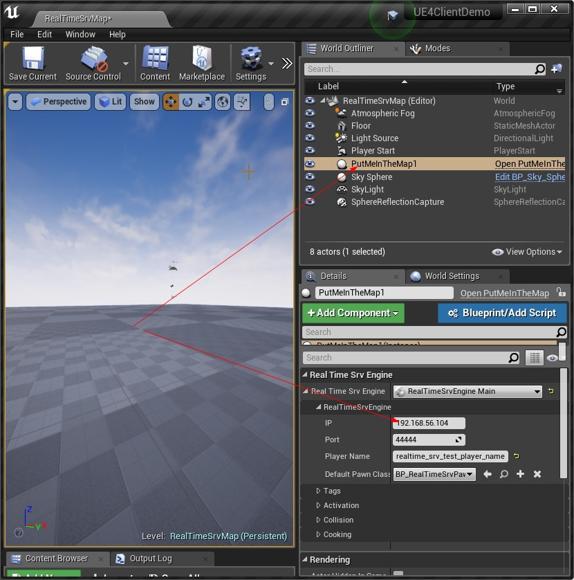

 
# A State Sync UE4 demo for [realtime-server](https://github.com/no5ix/realtime-server)

为[realtime-server](https://github.com/no5ix/realtime-server)而写的一个UE4状态同步demo

<!--  -->

<!-- 

# Download & Play
 
 
- Client : [UE4ClientDemo.exe (Win32)](https://pan.baidu.com/s/1B0pMYls7JVYqEWyKH4gkXg) , just check it out !

- 客户端 : 下载 [UE4ClientDemo.exe (Win32)](https://pan.baidu.com/s/1B0pMYls7JVYqEWyKH4gkXg) 玩一下 !

- Server : A server instance is running on my VPS, so just double click the UE4ClientDemo.exe that will connect to my server automatically, enjoy !

- 服务器 : 我VPS上运行着一个服务器实例, 你只需要双击 UE4ClientDemo.exe , 它就会自动连到服务器啦 

! -->

# About This 

- [Video Preview 视频演示](https://hulinhong.com)
- State Sync 状态同步
- No replication component from UE4, just socket 没有用UE4的网络同步组件, 唯socket而已
- UE4: 4.16 - 4.19
- Server side 服务端 : [realtime-server example](https://github.com/no5ix/realtime-server/tree/master/example/for_ue4_demo)
- Powered by 
    - [realtime-server](https://github.com/no5ix/realtime-server) (A realtime dedicated game server, for FPS/MOBA)
    - [kcpsess](https://github.com/no5ix/kcpsess) (A kcp session single-header-only implementation)

# Usage

# QQ群

加群 496687140 , 可以得到我的云服务器IP, 在上图里填写我的IP之后直接就可以体验游戏而无需编译服务器代码啦~~
